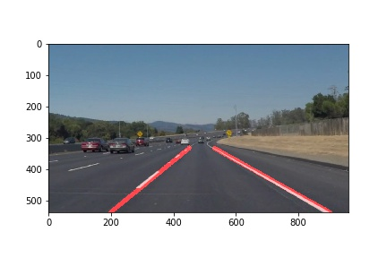
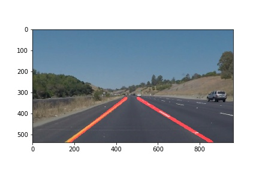
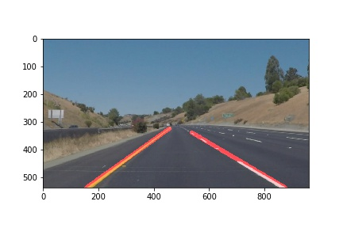
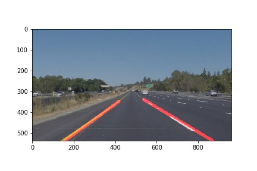
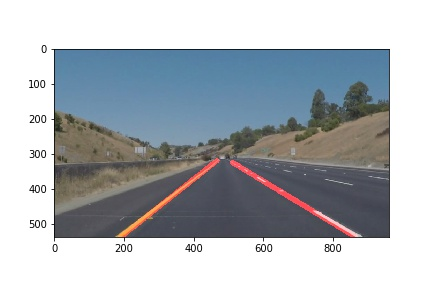

# **Finding Lane Lines on the Road**

The goals / steps of this project are the following:
* Make a pipeline that finds lane lines on the road
* Reflect on your work in a written report


[//]: # (Image References)

[image1]: ./examples/grayscale.jpg "Grayscale"

---

### Reflection

### 1. Describe your pipeline. As part of the description, explain how you modified the draw_lines() function.

Following what I learned during lesson 5, I based my pipeline to detect lane lines on the following steps:

1. Read the image and convert it to grayscale.
2. Apply a Gaussian Noise kernel (using kernel=5).
3. Canny transform (using low_threshold=70, high_threshold=140).
4. Define an area (square) of interest that contains the lane lines, applying an image mask. 
5. Obtain and draw Hough lines on the image, for which I used the following values after testing a few different scenarios:
    * rho = 2
    * theta = pi/180
    * threshold = 35
    * max_line_gap = 20
6. Using the image output of step 5, generate the result image, which represents the original image with the detected lines drawn on top of it.

These 6 steps use the `helper methods` provided to create a basic detection system for the lanes.

The goal of the assignment is to tweak the configuration and to adapt the `draw_lines` method to obtain a clearer drawn on top of the lane lines, with a single line for the left and a single one for the right.

To achieve this:

1. Calculate the slope to separate the lines corresponding to the left lane line and the right lane line. By doing this we can compose each line separately.

```python
slope = (y2-y1)/(x2-x1)
if slope < 0:
    # left line
elif slope > 0:
    # right line
```

2. In order to get a smoother view of the lines drawn on the image, I get the average of `x, y` for each line detected, and append it to a list (whether it is right or left), as follows.

```python
imshape = img.shape
right_lines = []
left_lines = []
left_slope = None
right_slope = None

for line in lines:
    for x1,y1,x2,y2 in line:
        x = int(np.average([x1,x2]))
        y = int(np.average([y1,y2]))
        slope = (y2-y1)/(x2-x1)
        # y = slope*x + b
        if slope < 0:
            left_lines.append((x, y))
            if not left_slope:
                b_left = int(y-(slope*x))
                left_slope = slope
        elif slope > 0:
            right_lines.append((x,y))
            if not right_slope:
                b_right = int(y-(slope*x))
                right_slope = slope 

```
3. I will also be using the equation of a line `y=ax+b` to set the origin of the lane on the bottom of the image (using x, y and the slope). I want to smooth the line in the image, so I extract the two furthest points of the line (I created two new methods to achieve this).

```python
if (left_slope and right_slope) and (left_slope and right_slope != 0):
    max_left = get_largest_left(left_lines)
    left_lines = [(int((imshape[0]-b_left)/left_slope), imshape[0]), max_left]
    max_right = get_largest_right(right_lines, imshape[1])
    right_lines = [(int((imshape[0]-b_right)/right_slope), imshape[0]), max_right]


def get_largest_left(lines):
    max_x = 0
    for line in lines:
        if line[0] > max_x:
            max_x = line[0]
            max_y = line[1]
    
    return (max_x, max_y)
              
    
def get_largest_right(lines, x_size):
    max_x = x_size
    for line in lines:
        if line[0] < max_x:
            max_x = line[0]
            max_y = line[1]
    
    return (max_x, max_y)
```
4. I can now draw the lines on the left and right, respectively.
```python
for x in range(0,len(left_lines)-1):
    cv2.line(img, left_lines[x], left_lines[x+1], color, thickness)
    
for x in range(0,len(right_lines)-1):
    cv2.line(img, right_lines[x], right_lines[x+1], color, thickness)
```

Following this procedure, I get the following outputs for the images.

[//]: # (Image References)



 
 



It applies as well for the video stream, which in the end is only a stream of images concatenated together.

### 2. Identify potential shortcomings with your current pipeline


The main problem with my solution is that I've not been able to apply a line drawn as smooth as the example provided. I've been trying to tweak my settings and testing different posibilities to obtain a better drawing on the image but I had no success. The example output shows a very realiable, almost static line prediction that I don't know how to obtain.

I also tried to adapt the source code of `draw_lines` to behave properly with the challenge video (detect a curve), but, again, with no luck. I thought about the possibility of detecting multiple smaller lines (which ultimately can form a curve when drawn together), but I always got a total mess with my tests (detections coming out of everywhere and no much sense on what I was doing).


### 3. Suggest possible improvements to your pipeline

As previously explained, the code should be smoother when drawing lane lines on straight roads. I understand that the "vibration" produced by the uneven line drawing could make the vision unusable in a practical scenario, so I should work on tweaking the settings further more, but so far, I haven't been successful when trying to improve the current situation.
